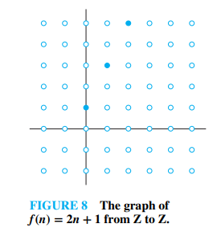
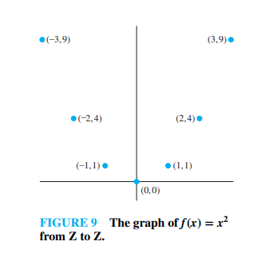

# The Graphs of Functions (Section 2.3.4)

---

### 1. The Mathematical Definition of a Graph

A graph is commonly viewed as a drawing on a coordinate grid, but the formal definition in set theory defines a graph as a specific **set of ordered pairs**. This connects the geometry of a graph directly back to set theory and coordinate systems.

> **Definition 11:** Let $f$ be a function from the set $A$ to the set $B$. The **graph** of the function $f$ is the set of ordered pairs $\{(a, b) \mid a \in A \text{ and } f(a) = b\}$.

* **The Coordinate View:** If we are working with real-valued functions ($f: \mathbf{R} \rightarrow \mathbf{R}$), these ordered pairs are exactly the $(x, y)$ coordinates we plot on a standard Cartesian plane where the horizontal axis represents the input ($x$) and the vertical axis represents the output ($y = f(x)$).

---

### 2. Textbook Examples

Discrete functions (where the domain is distinct/separate, like integers) and continuous algebraic functions behave differently when graphed.

#### **Textbook Example 25 (Graph of a Small Finite Set):**
Let $f$ be the function from the set of integers $\mathbf{Z}$ to $\mathbf{Z}$ defined by $f(n) = 2n + 1$. Display the graph of $f$.

* **Solution:** According to the definition, the graph of $f$ is the set of ordered pairs of the form $(n, 2n + 1)$ for all integers $n$.
* If we list a few pairs, we get: $\{\dots, (-2, -3), (-1, -1), (0, 1), (1, 3), (2, 5), \dots\}$.
* **Visualizing it:** Because the domain is restricted strictly to *integers* ($\mathbf{Z}$), the graph is **not** a solid, unbroken line. Instead, it consists of a sequence of **isolated, distinct points** plotted along a straight path on the coordinate plane.

#### **Textbook Example 26 (Graph of a Floor Function Variation):**
Display the graph of the function $f(x) = x^2$ from the set of integers $\mathbf{Z}$ to $\mathbf{Z}$.

* **Solution:** The graph is the set of pairs $(n, n^2)$ for all integers $n$.
* The pairs include: $\{\dots, (-2, 4), (-1, 1), (0, 0), (1, 1), (2, 4), \dots\}$.
* **Visualizing it:** Just like Example 25, because the domain is $\mathbf{Z}$, this graph consists of **individual dots** that outline the shape of a parabola, rather than a single smooth curve.

---

### 3. The Vertical Line Test

While graphing discrete functions results in collections of isolated points, real-valued functions mapped over continuous domains follow a foundational check: **The Vertical Line Test**.

Because a function must assign **exactly one** output to each input, a vertical line drawn anywhere on the graph can never intersect the graph more than once.
* If a vertical line hits a curve **twice or more**, it means a single input $x$ maps to multiple outputs $y$, which violates the definition of a function.

---

### 🧠 Quick Check: Try it Yourself!

Let $A = \{1, 2, 3\}$ and $B = \{1, 2\}$. Consider the following set of ordered pairs:
$$G = \{(1, 1), (2, 2), (3, 1)\}$$

1. Does $G$ represent a valid graph of a function from $A$ to $B$?
2. If we added the ordered pair $(2, 1)$ to the set $G$, would it still represent the graph of a valid function?

---

### 💡 Solutions & Explanation

> [!NOTE]
> Here are the step-by-step verification answers for the check above:
> 
> 1. **Does $G$ represent a valid graph of a function?** **Yes**.
>    * *Why?* The domain is $A = \{1, 2, 3\}$. Every element in $A$ appears exactly once as the first component of an ordered pair in $G$ (1, 2, and 3 are mapped to 1, 2, and 1 respectively). Because each element in the domain maps to exactly one element in the codomain $B$, $G$ is a valid function.
> 2. **Would adding $(2, 1)$ to $G$ still represent a valid function?** **No**.
>    * *Why?* If we include $(2, 1)$, the set becomes $\{(1, 1), (2, 2), (3, 1), (2, 1)\}$. In this case, the element $2$ in the domain $A$ maps to two different outputs in $B$ (both $2$ and $1$). This violates the requirement that a function maps each input to exactly one output.

---

## Related Links
- [[12. Inverse Functions and Composition]] - The previous section covering inverse operations, function compositions, and identity mappings.
- [[14. Floor and Ceiling Functions]] - The next section detailing Floor and Ceiling functions, step graphs, and applications.
- [[Sets, Relations and Functions Index]] - Main chapter index and syllabus checklist for Sets, Relations, and Functions.
- [[Discrete Mathematics Dashboard]] - Central dashboard for tracking progress across all chapters.
