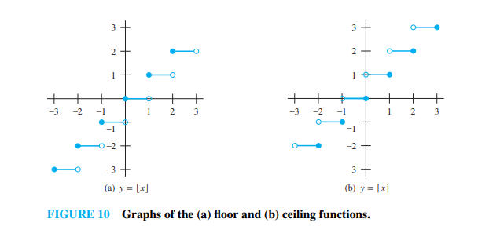

# Floor and Ceiling Functions (Section 2.3.5)

---

### 1. The Floor and Ceiling Functions

When dealing with a real number $x$, we often need to round it to a neighboring integer.

> **Definition 12 (The Floor Function):** The floor function assigns to a real number $x$ the **largest integer** that is less than or equal to $x$. The value of the floor function at $x$ is denoted by **$\lfloor x \rfloor$**.
> *(Note: It is also historically known as the **greatest integer function** and denoted by $[x]$)*.

> **Definition 12 (The Ceiling Function):** The ceiling function assigns to a real number $x$ the **smallest integer** that is greater than or equal to $x$. The value of the ceiling function at $x$ is denoted by **$\lceil x \rceil$**.

In plain terms:
* **Floor $\lfloor x \rfloor$** rounds $x$ **down** toward the next lower integer.
* **Ceiling $\lceil x \rceil$** rounds $x$ **up** toward the next higher integer.

#### **Textbook Example 28:**
Here are direct textbook evaluations:
* $\lfloor 3.1 \rfloor = 3$ (since $3$ is the largest integer $\le 3.1$).
* $\lceil 3.1 \rceil = 4$ (since $4$ is the smallest integer $\ge 3.1$).
* $\lfloor \frac{1}{2} \rfloor = 0$
* $\lceil \frac{1}{2} \rceil = 1$
* $\lfloor 7 \rfloor = 7$ and $\lceil 7 \rceil = 7$ (if $x$ is already an integer, floor and ceiling change nothing).

#### **⚠️ The Negative Number Trap!**
Pay very close attention to negative numbers when rounding:
* $\lfloor -\frac{1}{2} \rfloor = -1$ (since $-1$ is the largest integer *less than or equal to* $-0.5$).
* $\lceil -\frac{1}{2} \rceil = 0$ (since $0$ is the smallest integer *greater than or equal to* $-0.5$).

#### **Visualizing their Graphs**
The graphs of these functions resemble staircases (step graphs):
* The floor function step graph stays at integer $n$ over the half-open interval $[n, n+1)$ before jumping up.
* The ceiling function step graph holds the value $n+1$ over the interval $(n, n+1]$.

---

### 2. Practical Computer Science Applications

The textbook provides two practical everyday engineering examples of these functions.

#### **Textbook Example 29 (Data Packing):**
Computer data networks transmit information in blocks called bytes, where each byte is exactly 8 bits. How many bytes are required to encode $100$ bits of data?

* **Solution:** Dividing $100$ by $8$ yields $12.5$ bytes. Because physical storage bytes cannot be fractional, we must round up to the next integer to ensure all bits fit securely:
  $$\lceil 100 / 8 \rceil = \lceil 12.5 \rceil = \mathbf{13 \text{ bytes}}$$

#### **Textbook Example 30 (Network Transmission Limits):**
In Asynchronous Transfer Mode (ATM) network protocols, data is bundled into cells of 53 bytes each. How many complete ATM cells can be transmitted in 1 minute over a link carrying 500 kilobits per second?

* **Solution:**
  1. Calculate total bits sent in 1 minute:
     $$500,000 \text{ bits/sec} \times 60 \text{ seconds} = 30,000,000 \text{ bits}$$
  2. Calculate bits per ATM cell:
     $$53 \text{ bytes} \times 8 \text{ bits/byte} = 424 \text{ bits}$$
  3. Since partial network cells cannot be processed, we require the largest integer *not exceeding* the raw capacity quotient (round down):
     $$\lfloor 30,000,000 / 424 \rfloor = \mathbf{70,754 \text{ cells}}$$

---

### 3. Proving Properties Using Fractional Parts

A brilliant mathematical technique for evaluating advanced floor proofs consists of writing real numbers using an **integer part** ($n$) and a **fractional part** ($\epsilon$):
* We can write any real number as: **$x = n + \epsilon$**
* Where $n = \lfloor x \rfloor$ is an integer, and $0 \le \epsilon < 1$.

#### **Textbook Example 31:**
Prove that if $x$ is a real number, then $\lfloor 2x \rfloor = \lfloor x \rfloor + \lfloor x + \frac{1}{2} \rfloor$.

* **Solution Proof:** We set $x = n + \epsilon$ where $n$ is an integer and $0 \le \epsilon < 1$. Because we are doubling $x$ and adding $\frac{1}{2}$, our fractional remainder $\epsilon$ crosses a threshold at $\frac{1}{2}$. This splits our proof into two logical cases:
  * **Case 1: $0 \le \epsilon < \frac{1}{2}$**
    * **Left-Hand Side (LHS):** $2x = 2n + 2\epsilon$. Since $0 \le 2\epsilon < 1$, rounding down drops the fraction:
      $$\lfloor 2x \rfloor = \mathbf{2n}$$
    * **Right-Hand Side (RHS):** $\lfloor x \rfloor = n$. For the second term, $x + \frac{1}{2} = n + (\epsilon + \frac{1}{2})$. Since $0 < \epsilon + \frac{1}{2} < 1$, it rounds down to $n$:
      $$\lfloor x \rfloor + \lfloor x + \frac{1}{2} \rfloor = n + n = \mathbf{2n}$$
    * Both sides match.

  * **Case 2: $\frac{1}{2} \le \epsilon < 1$**
    * **Left-Hand Side (LHS):** $2x = 2n + 2\epsilon$. Because $\frac{1}{2} \le \epsilon$, we know $1 \le 2\epsilon < 2$, which can be rewritten as $(2n + 1) + (2\epsilon - 1)$. This pushes past the integer threshold:
      $$\lfloor 2x \rfloor = \mathbf{2n + 1}$$
    * **Right-Hand Side (RHS):** $\lfloor x \rfloor = n$. For the second term, $x + \frac{1}{2} = n + \epsilon + \frac{1}{2}$. Since $\epsilon \ge \frac{1}{2}$, the sum $\epsilon + \frac{1}{2} \ge 1$, which can be written as $(n + 1) + (\epsilon - \frac{1}{2})$. This yields $\lfloor x + \frac{1}{2} \rfloor = n + 1$:
      $$\lfloor x \rfloor + \lfloor x + \frac{1}{2} \rfloor = n + (n + 1) = \mathbf{2n + 1}$$
    * Both sides match.

The proof is complete!

---

### 🧠 Quick Check: Try it Yourself!

Evaluate these two nested operations:
1. $\lfloor \frac{1}{2} + \lceil \frac{1}{2} \rceil \rfloor$
2. $\lfloor -0.1 \rfloor$

---

### 💡 Solutions & Explanation

> [!NOTE]
> Here are the step-by-step verification answers for the check above:
> 
> 1. **$\lfloor \frac{1}{2} + \lceil \frac{1}{2} \rceil \rfloor$:** **$1$**.
>    * *Proof:* Work from the inside out. First, evaluate the ceiling function: $\lceil \frac{1}{2} \rceil = \lceil 0.5 \rceil = 1$.
>      Next, substitute that result back into the outer floor function: $\lfloor \frac{1}{2} + 1 \rfloor = \lfloor 1.5 \rfloor = 1$.
> 2. **$\lfloor -0.1 \rfloor$:** **$-1$**.
>    * *Proof:* The floor function rounds down to the largest integer less than or equal to the input. Because $-0.1$ lies strictly between $-1$ and $0$, the closest integer that is less than or equal to $-0.1$ is $-1$.

---

## Related Links
- [[13. The Graphs of Functions]] - The previous section detailing the definition, examples, and visualization of mathematical graphs.
- [[15. Partial Functions]] - The next section detailing partial functions, domains of definition, and total functions.
- [[Sets, Relations and Functions Index]] - Main chapter index and syllabus checklist for Sets, Relations, and Functions.
- [[Discrete Mathematics Dashboard]] - Central dashboard for tracking progress across all chapters.
