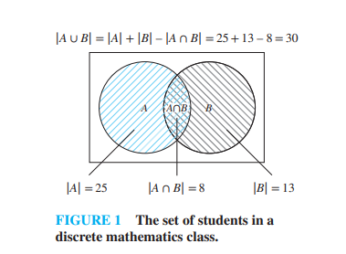
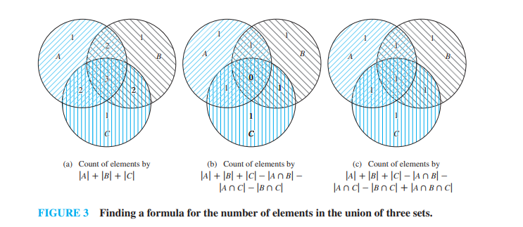

# The Principle of Inclusion-Exclusion (Section 8.5)

---

### Section 8.5.1: Introduction

A fundamental question in counting introduces a common logical trap:

> **Textbook Problem:** A discrete mathematics class contains 30 women and 50 sophomores. How many students in the class are either women or sophomores?

This question **cannot be answered** without additional information. Simply adding the numbers ($30 + 50 = 80$) results in an incorrect answer because any student who is **both** a woman and a sophomore will be counted twice.

To get an accurate count, you must find the sum of the individual groups and then **subtract the overcount** (the students in the overlapping intersection). The goal of this section is to generalize this exact approach to handle scenarios involving any number of overlapping sets.

---

### Section 8.5.2: The Principle of Inclusion–Exclusion

The textbook systematically builds the formula by looking at 2 sets, then 3 sets, and finally generalizing to $n$ sets.

#### **1. The Case of Two Sets**
For two finite sets $A$ and $B$, the cardinality of their union is defined by the formula:
$$|A \cup B| = |A| + |B| - |A \cap B|$$

#### **Textbook Example 1:**
In a discrete mathematics class, every student is a major in computer science or mathematics, or both. The number of students majoring in computer science is 25, the number of students majoring in mathematics is 13, and the number of students majoring in both is 8. How many students are in the class?
* **Solution:** Let $A$ be the computer science majors and $B$ be the mathematics majors. We are given $|A| = 25$, $|B| = 13$, and $|A \cap B| = 8$. Since every student is in at least one of these majors, the total class size is $|A \cup B|$:
  $$|A \cup B| = 25 + 13 - 8 = \mathbf{30 \text{ students}}$$

#### **Textbook Example 3 (Counting the Outside Elements):**
Suppose that there are 1807 freshmen at your school. Of these, 453 are taking computer science, 567 are taking mathematics, and 299 are taking both. How many are **not** taking either computer science or mathematics?
* **Solution:**
  1. Let $A$ be the set of freshmen in computer science ($|A| = 453$) and $B$ be those in math ($|B| = 567$), with $|A \cap B| = 299$.
  2. Find the number of students taking at least one of these courses ($|A \cup B|$):
     $$|A \cup B| = 453 + 567 - 299 = 721$$
  3. Subtract this from the total universal set of freshmen ($U$) to find those taking neither:
     $$1807 - 721 = \mathbf{1086 \text{ students}}$$

---

#### **2. The Case of Three Sets**
To find the size of the union of three sets ($A, B,$ and $C$), we evaluate the count in three stages:
1. **Include** all single sets: $|A| + |B| + |C|$. Elements in exactly two sets are counted twice, and elements in all three sets are counted three times.
2. **Exclude** the double-counted intersections: Subtract $- |A \cap B| - |A \cap C| - |B \cap C|$. Now elements in exactly two sets are correctly counted once. However, elements in all three sets were included 3 times and subtracted 3 times, leaving them completely uncounted (0 times).
3. **Include** the center back in: Add $+ |A \cap B \cap C|$.

$$\mathbf{|A \cup B \cup C| = |A| + |B| + |C| - |A \cap B| - |A \cap C| - |B \cap C| + |A \cap B \cap C|}$$

---

#### **3. The General Principle for $n$ Sets**
The textbook codifies this alternating "include, exclude, include, exclude" behavior under Theorem 1:

> **Theorem 1 (The Principle of Inclusion–Exclusion):** Let $A_1, A_2, \dots, A_n$ be finite sets. Then:
> $$|A_1 \cup A_2 \cup \dots \cup A_n| = \sum_{1 \le i \le n} |A_i| - \sum_{1 \le i < j \le n} |A_i \cap A_j| + \sum_{1 \le i < j < k \le n} |A_i \cap A_j \cap A_k| - \dots + (-1)^{n+1} |A_1 \cap A_2 \cap \dots \cap A_n|$$

* **Number of Terms:** For a union of $n$ sets, there are **$2^n - 1$ terms** in the expanded formula, corresponding to every possible non-empty subset intersection.

#### **Textbook Example 5 (Four Sets):**
Give a formula for the number of elements in the union of four sets ($A_1, A_2, A_3, A_4$).
* **Solution:** According to the principle, we construct a formula containing $2^4 - 1 = 15$ terms:
  $$\begin{aligned}
  |A_1 \cup A_2 \cup A_3 \cup A_4| = & \, |A_1| + |A_2| + |A_3| + |A_4| \\
  & - |A_1 \cap A_2| - |A_1 \cap A_3| - |A_1 \cap A_4| - |A_2 \cap A_3| - |A_2 \cap A_4| - |A_3 \cap A_4| \\
  & + |A_1 \cap A_2 \cap A_3| + |A_1 \cap A_2 \cap A_4| + |A_1 \cap A_3 \cap A_4| + |A_2 \cap A_3 \cap A_4| \\
  & - |A_1 \cap A_2 \cap A_3 \cap A_4|
  \end{aligned}$$

---

### 🧠 Quick Check: Try it Yourself!

A survey of 100 students finds that 50 students use Python, 40 use Java, and 30 use C++. Furthermore, 15 use both Python and Java, 10 use Python and C++, 8 use Java and C++, and 5 use all three programming languages.

1. Write out the formula to find the number of students who use **at least one** of these three languages.
2. Calculate the total numerical value.

---

### 💡 Solutions & Explanation

> [!NOTE]
> Here are the step-by-step verification answers for the check above:
> 
> Let $P$ be the set of students using Python, $J$ be those using Java, and $C$ be those using C++.
> 
> 1. **The Union Formula:**
>    $$|P \cup J \cup C| = |P| + |J| + |C| - |P \cap J| - |P \cap C| - |J \cap C| + |P \cap J \cap C|$$
> 2. **Numerical Calculation:**
>    Substitute the given values into the formula:
>    * Single sets: $|P| = 50$, $|J| = 40$, $|C| = 30$
>    * Double intersections: $|P \cap J| = 15$, $|P \cap C| = 10$, $|J \cap C| = 8$
>    * Triple intersection: $|P \cap J \cap C| = 5$
>    $$|P \cup J \cup C| = 50 + 40 + 30 - 15 - 10 - 8 + 5$$
>    $$|P \cup J \cup C| = 120 - 33 + 5 = \mathbf{92 \text{ students}}$$
>    *(Thus, 92 out of 100 students surveyed use at least one of these three languages, meaning 8 students use none of them).*

---

## Related Links
- [[18. Summations]] - The previous section detailing summation notations, indexing shortcuts, and index shifts.
- [[20. Introduction to Relations]] - The next section introducing binary relations, relations vs. functions, and relations on a single set.
- [[Sets, Relations and Functions Index]] - Main chapter index and syllabus checklist for Sets, Relations, and Functions.
- [[Discrete Mathematics Dashboard]] - Central dashboard for tracking progress across all chapters.
