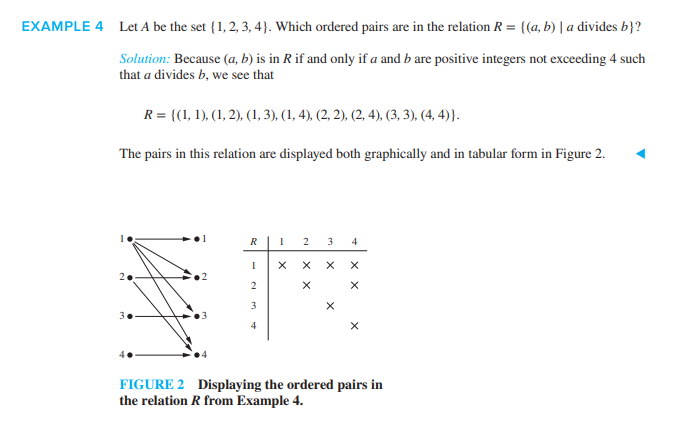

# Relations on a Set (Section 9.1.3)

---

### 1. Defining a Relation on a Set

We frequently analyze relationships where the domain and the codomain are the exact same set (e.g., matching webpages to other webpages they link to, or elements in a database sharing a common attribute).

> **Definition 2:** A relation on a set $A$ is a relation from $A$ to $A$. In other words, a relation on a set $A$ is a subset of the Cartesian product $A \times A$.

#### **Textbook Example 4:**
Let $A = \{a, b, c\}$. Which of the following relations are relations on $A$?
* $R_1 = \{(a, a), (a, b), (c, b)\}$
* $R_2 = \{(a, 1), (a, c), (b, b)\}$
* $R_3 = \{(a, c), (b, c), (c, a), (c, c)\}$

* **Solution:**
  To be a relation on $A$, every single ordered pair in the set must consist *only* of elements from $A$.
  * **$R_1$ is a relation on $A$** because all elements in the ordered pairs ($a, b, c$) belong to $A$.
  * **$R_2$ is not a relation on $A$** because the pair $(a, 1)$ contains the number $1$, which is not in set $A$.
  * **$R_3$ is a relation on $A$** because all coordinates are strictly chosen from $\{a, b, c\}$.

---

### 2. Visualizing Relations on a Set

When a relation is defined on a single set, we do not need a two-sided mapping diagram. Instead, the textbook introduces two key visualization methods:

1. **Tabular Form:** A grid where rows and columns represent the elements of the set, and a mark (such as $\times$) denotes related pairs.
2. **Directed Graphs (Digraphs):** 
   * Each element of the set $A$ is drawn as a point or node called a **vertex**.
   * Each ordered pair $(a, b)$ in the relation is drawn as an arrow called a **directed edge** pointing from vertex $a$ to vertex $b$.
   * If an element relates to itself—a pair like $(a, a)$—it is drawn as an arrow pointing from $a$ right back to $a$, which is called a **loop**.

---

### 3. Counting the Total Number of Relations

*How many different possible relations can we define on a set $A$ containing $n$ elements?*

We derive this formula using combinatorics and subset rules:
1. A relation on $A$ is a subset of $A \times A$.
2. If set $A$ has $n$ elements, then the Cartesian product $A \times A$ has $n \times n = n^2$ elements.
3. A set with $k$ elements has exactly $2^k$ total subsets (its power set).
4. Since our relation is a subset of a set containing $n^2$ elements, the total number of possible relations is:
   $$\mathbf{2^{n^2}}$$

#### **Textbook Example 5:**
How many distinct relations are there on a set with 3 elements?
* **Solution:** Here, $n = 3$.
  * The number of elements in the Cartesian product is $3^2 = 9$.
  * The total number of possible subsets (and therefore relations) is:
    $$2^9 = \mathbf{512 \text{ different relations}}$$

---

### 🧠 Quick Check: Try it Yourself!

Let $A = \{1, 2\}$.

1. How many total elements are in the Cartesian product $A \times A$?
2. How many **total possible relations** can be defined on the set $A$?
3. Write down a relation on $A$ that consists of exactly 4 ordered pairs (this is called the *universal relation* on $A$).

---

### 💡 Solutions & Explanation

> [!NOTE]
> Here are the step-by-step verification answers for the check above:
> 
> 1. **Elements in $A \times A$:** **$4$**.
>    * *Proof:* The Cartesian product contains all possible ordered pairings: $A \times A = \{(1, 1), (1, 2), (2, 1), (2, 2)\}$. The total is $2 \times 2 = 4$.
> 2. **Total Possible Relations on $A$:** **$16$**.
>    * *Proof:* Since $|A \times A| = 4$, the number of possible subsets (relations) is $2^4 = 16$.
> 3. **Universal Relation on $A$:** **$\{(1, 1), (1, 2), (2, 1), (2, 2)\}$**.
>    * *Proof:* The universal relation contains every possible pair from the Cartesian product, which uses all 4 available elements.

---

## Related Links
- [[21. Functions as Relations]] - The previous section detailing how functions represent a restricted subset of binary relations.
- [[23. Properties of Relations]] - The next section introducing key structural properties of relations: reflexivity, symmetry, antisymmetry, and transitivity.
- [[Sets, Relations and Functions Index]] - Main chapter index and syllabus checklist for Sets, Relations, and Functions.
- [[Discrete Mathematics Dashboard]] - Central dashboard for tracking progress across all chapters.
