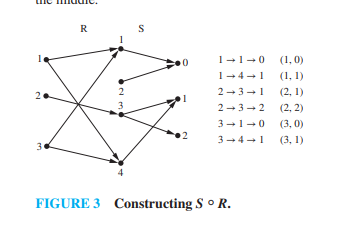

# Combining Relations (Section 9.1.5)

---

Since relations are sets of ordered pairs, we can combine them using the standard set operations studied in Chapter 2 (Union, Intersection, and Difference). Additionally, we can combine them through a unique sequential operation called **composition**.

---

### 1. Set-Theoretic Operations

Because relations $R_1$ and $R_2$ from set $A$ to set $B$ are subsets of the Cartesian product $A \times B$, their combinations are also subsets of $A \times B$:

* **Union ($R_1 \cup R_2$):** Contains all pairs that belong to $R_1$ **or** $R_2$:
  $$R_1 \cup R_2 = \{(a, b) \mid (a, b) \in R_1 \lor (a, b) \in R_2\}$$
* **Intersection ($R_1 \cap R_2$):** Contains all pairs that belong to both $R_1$ **and** $R_2$:
  $$R_1 \cap R_2 = \{(a, b) \mid (a, b) \in R_1 \land (a, b) \in R_2\}$$
* **Difference ($R_1 - R_2$):** Contains all pairs that are in $R_1$ but **not** in $R_2$:
  $$R_1 - R_2 = \{(a, b) \mid (a, b) \in R_1 \land (a, b) \notin R_2\}$$

#### **Textbook Example 8:**
Let $A = \{1, 2, 3\}$ and $B = \{1, 2, 3, 4\}$.
Let $R_1 = \{(1, 1), (2, 2), (3, 3)\}$ and $R_2 = \{(1, 1), (1, 2), (1, 3), (1, 4)\}$.

* **Union:** $R_1 \cup R_2 = \{(1, 1), (2, 2), (3, 3), (1, 2), (1, 3), (1, 4)\}$
* **Intersection:** $R_1 \cap R_2 = \{(1, 1)\}$
* **Difference:** $R_1 - R_2 = \{(2, 2), (3, 3)\}$

---

### 2. Composition of Relations

Composition is the process of chaining two relations together.

> **Definition 7:** Let $R$ be a relation from $A$ to $B$, and $S$ be a relation from $B$ to $C$. The **composite of $S$ and $R$**, denoted by $S \circ R$, is the relation from $A$ to $C$ containing pairs $(a, c)$ such that there exists an element $b \in B$ where $(a, b) \in R$ and $(b, c) \in S$.

* **Chaining Logic:** Think of it as a pathfinding operation. If you can traverse from $a \rightarrow b$ (via $R$) and then from $b \rightarrow c$ (via $S$), then the composite relation $S \circ R$ creates a "shortcut" pairing $(a, c)$.

#### **Textbook Example 10:**
Let $R = \{(1, 1), (1, 4), (2, 3), (3, 1), (3, 4)\}$ and $S = \{(1, 0), (2, 0), (3, 1), (3, 2), (4, 1)\}$.
Find $S \circ R$.

* **Solution:** We trace intermediate elements $b \in B$ linking $a \in A$ to $c \in C$:
  * $(1, 1) \in R$ and $(1, 0) \in S \rightarrow \mathbf{(1, 0)}$
  * $(1, 4) \in R$ and $(4, 1) \in S \rightarrow \mathbf{(1, 1)}$
  * $(2, 3) \in R$ and $(3, 1) \in S \rightarrow \mathbf{(2, 1)}$
  * $(2, 3) \in R$ and $(3, 2) \in S \rightarrow \mathbf{(2, 2)}$
  * $(3, 1) \in R$ and $(1, 0) \in S \rightarrow \mathbf{(3, 0)}$
  * $(3, 4) \in R$ and $(4, 1) \in S \rightarrow \mathbf{(3, 1)}$
* Putting these pairs together:
  $$S \circ R = \{(1, 0), (1, 1), (2, 1), (2, 2), (3, 0), (3, 1)\}$$

---

### 3. Powers of a Relation

When we compose a relation $R$ on a set $A$ with itself, we can define structural **powers** of that relation recursively:
* $R^1 = R$
* $R^2 = R \circ R$
* $R^{n+1} = R^n \circ R$

* **Relevance to Transitivity:** A relation $R$ is transitive if and only if $R^n \subseteq R$ for all positive integers $n = 1, 2, 3, \dots$.

---

### 🧠 Quick Check: Try it Yourself!

Let $R = \{(1, 2), (2, 3)\}$ and $S = \{(2, 1), (3, 2)\}$.
1. Find $S \circ R$.
2. Find $R \circ S$.

---

### 💡 Solutions & Explanation

> [!NOTE]
> Here are the step-by-step verification answers for the check above:
> 
> 1. **$S \circ R$:** **$\{(1, 1), (2, 2)\}$**.
>    * *Proof:* We look for paths of the form $a \xrightarrow{R} b \xrightarrow{S} c$:
>      * For $(1, 2) \in R$: we find $(2, 1) \in S \implies (1, 1) \in S \circ R$.
>      * For $(2, 3) \in R$: we find $(3, 2) \in S \implies (2, 2) \in S \circ R$.
> 2. **$R \circ S$:** **$\{(2, 2), (3, 3)\}$**.
>    * *Proof:* We look for paths of the form $a \xrightarrow{S} b \xrightarrow{R} c$:
>      * For $(2, 1) \in S$: we find $(1, 2) \in R \implies (2, 2) \in R \circ S$.
>      * For $(3, 2) \in S$: we find $(2, 3) \in R \implies (3, 3) \in R \circ S$.

---

## Related Links
- [[23. Properties of Relations]] - The previous section covering key properties of relations on a set (reflexive, symmetric, antisymmetric, transitive).
- [[25. Representing Relations]] - The next section detailing how finite relations are represented and stored using zero-one matrices.
- [[Sets, Relations and Functions Index]] - Main chapter index and syllabus checklist for Sets, Relations, and Functions.
- [[Discrete Mathematics Dashboard]] - Central dashboard for tracking progress across all chapters.
