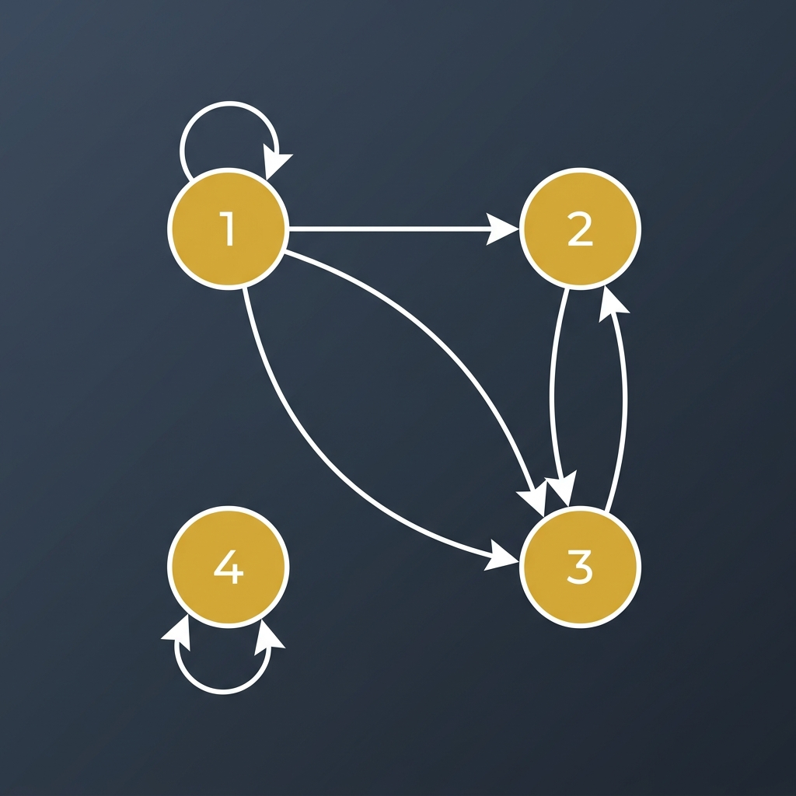

# Representing Relations Using Digraphs (Section 9.3.3)

---

While matrices are excellent for computer memory and algebraic computations, **directed graphs (digraphs)** are the superior tool for human visualization and for analyzing the logic of a relation. 

---

### 1. The Structure of a Digraph

A **directed graph**, or **digraph**, consists of a set $V$ of **vertices** (or nodes) together with a set $E$ of ordered pairs of elements of $V$ called **edges** (or directed edges, arcs). The vertex $a$ is called the *initial vertex* of the directed edge $(a, b)$, and the vertex $b$ is called the *terminal vertex* of this edge.

For a relation $R$ on a set $A$:
* **Vertices:** Each element in set $A$ is represented by a dot or circle (a vertex).
* **Edges:** If $(a, b) \in R$, we draw a directed arrow pointing from vertex $a$ to vertex $b$.
* **Loops:** If $(a, a) \in R$, we draw a circular arrow (a loop) from vertex $a$ back to itself.

---

### 2. Properties of Relations in Digraphs

The mathematical properties of a relation become instantly visible when visualized as a digraph:

* **Reflexive:** Every vertex in the digraph must have a self-loop. If even one vertex lacks a loop, the relation is not reflexive.
* **Symmetric:** For every directed edge between two distinct vertices, there must be a matching return arrow going in the opposite direction. (i.e., edges always appear as two-way paths between distinct vertices).
* **Antisymmetric:** Between any two distinct vertices, there is **at most one** directed edge. There are never matching two-way arrows between different vertices.
* **Transitive:** If you can walk from vertex $a$ to $b$ and from $b$ to $c$ via directed edges, there must be a direct "shortcut" edge pointing from $a$ to $c$. (This must hold for all sequences of directed edges of length two).

---

### 3. Textbook Example

#### **TEXTBOOK EXAMPLE 6**
Draw the digraph for the relation:
$$R = \{(1, 1), (1, 3), (2, 1), (2, 3), (2, 4), (3, 1), (3, 4), (4, 1), (4, 3)\}$$
on the set $A = \{1, 2, 3, 4\}$.

**Solution Strategy:**
1. **Draw 4 vertices:** Label them $1, 2, 3,$ and $4$.
2. **Add the loops:** Since $(1, 1) \in R$, draw a self-loop at vertex $1$. No other self-loops exist.
3. **Draw the edges:** 
   * Draw an arrow from $1$ to $3$.
   * Draw arrows from $2$ to $1$, $2$ to $3$, and $2$ to $4$.
   * Draw arrows from $3$ to $1$ and $3$ to $4$.
   * Draw arrows from $4$ to $1$ and $4$ to $3$.

This visual representation immediately shows the structural paths and complexity of the relation:
* It is **not reflexive** (vertices 2, 3, and 4 lack loops).
* It is **not symmetric** (e.g., we have $2 \to 1$ but no $1 \to 2$).
* It is **not antisymmetric** (we have both $1 \to 3$ and $3 \to 1$, and both $3 \to 4$ and $4 \to 3$).

---

### 🧠 Quick Check: Try it Yourself!

Given a digraph with vertices $\{A, B\}$ and edges $\{(A, B), (B, A)\}$, identify:
1. Is it reflexive?
2. Is it symmetric?
3. What is its matrix representation?

---

### 💡 Solutions & Explanation

> [!NOTE]
> Here are the step-by-step verification answers for the check above:
> 
> 1. **Is it reflexive?** **No**.
>    * *Proof:* For the relation to be reflexive, every vertex in the set $\{A, B\}$ must have a loop. In this digraph, neither vertex $A$ nor vertex $B$ has a loop (i.e., $(A, A) \notin R$ and $(B, B) \notin R$).
> 2. **Is it symmetric?** **Yes**.
>    * *Proof:* For every directed edge between distinct vertices, there is a matching return arrow. We have $(A, B) \in R$ and its return edge $(B, A) \in R$ is also present.
> 3. **Matrix Representation $M_R$:**
>    Ordering the elements of the set alphabetically as $v_1 = A, v_2 = B$, we get:
>    $$M_R = \begin{bmatrix} 0 & 1 \\ 1 & 0 \end{bmatrix}$$
>    Since the matrix is symmetric across the main diagonal ($M_R = M_R^T$), this algebraically confirms the relation is symmetric. Since the main diagonal entries are not all 1, it confirms the relation is not reflexive.

---

### 🌐 Extra Challenge: Practice Question

Consider the directed graph shown below representing a relation $R$ on the set $A = \{1, 2, 3, 4\}$.

#### **Questions:**
1. List all the ordered pairs in the relation $R$ represented by this digraph.
2. Write down the $4 \times 4$ zero-one matrix representation $M_R$.
3. Determine if the relation is **reflexive**, **symmetric**, **antisymmetric**, or **transitive**. Provide a brief mathematical justification for each property.

---

### 💡 Extra Challenge: Detailed Solution

> [!TIP]
> Try to solve the questions above on your own before expanding the solution details below!
> 
> * **1. List of Ordered Pairs:**
>   By tracing the loops and arrows:
>   $$R = \{(1, 1), (1, 2), (1, 3), (2, 3), (3, 2), (4, 4)\}$$
> 
> * **2. Zero-One Matrix $M_R$:**
>   $$M_R = \begin{bmatrix} 1 & 1 & 1 & 0 \\ 0 & 0 & 1 & 0 \\ 0 & 1 & 0 & 0 \\ 0 & 0 & 0 & 1 \end{bmatrix}$$
> 
> * **3. Property Analysis:**
>   * **Reflexive?** **No**. Although vertices $1$ and $4$ have self-loops, vertices $2$ and $3$ do not have self-loops (i.e., $(2, 2) \notin R$ and $(3, 3) \notin R$). For $R$ to be reflexive, every vertex must have a loop.
>   * **Symmetric?** **No**. There is a directed edge from $1$ to $2$ ($(1, 2) \in R$), but there is no directed edge from $2$ to $1$ ($(2, 1) \notin R$). (Note: while $2$ and $3$ form a symmetric pair, symmetry must hold for *all* related pairs).
>   * **Antisymmetric?** **No**. Both $(2, 3) \in R$ and $(3, 2) \in R$ exist, but $2 \neq 3$. An antisymmetric relation cannot contain two-way arrows between distinct elements.
>   * **Transitive?** **No**. We have $(3, 2) \in R$ and $(2, 3) \in R$. For transitivity to hold, the composite "shortcut" must exist, which would require $(3, 3) \in R$ and $(2, 2) \in R$. Since neither is in $R$, the transitive property is violated. (Similarly, $(1, 3) \in R$ and $(3, 2) \in R$ has the shortcut $(1, 2) \in R$, which exists, but a single violation is enough to render the entire relation non-transitive).

---

## Related Links
- [[25. Representing Relations]] - The previous section detailing zero-one matrix representations of binary relations.
- [[Sets, Relations and Functions Index]] - Main chapter index and syllabus checklist for Sets, Relations, and Functions.
- [[Discrete Mathematics Dashboard]] - Central dashboard for tracking progress across all chapters.
