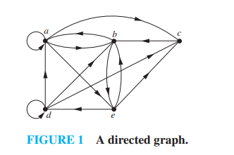

# Closures of Relations (Sections 9.4 - 9.4.4)

---

In many applications, we encounter relations that *almost* satisfy a property (such as reflexivity, symmetry, or transitivity), but not quite. **Closures** provide the mathematical machinery to take any relation and "add the fewest possible number of ordered pairs" to force it to satisfy that desired property.

---

### Section 9.4.1: Introduction

If a relation $R$ on a set $A$ does not have a property $P$ (such as reflexivity, symmetry, or transitivity), we want to find the **smallest** relation $R'$ that contains $R$ and has property $P$. 

> **Definition 1:** If $R$ is a relation on a set $A$, then the **closure** of $R$ with respect to a property $P$, if it exists, is the relation $R'$ such that:
> 1. $R \subseteq R'$
> 2. $R'$ has the property $P$
> 3. If $S$ is any other relation containing $R$ that has the property $P$, then $R' \subseteq S$ (meaning $R'$ is the *unique smallest* such relation).

* **Analogy:** Think of this like "patching" a communication network: if you need your computer network (represented by relation $R$) to be fully connected (transitive), you add exactly the minimum number of missing direct paths to fulfill that requirement without changing any of the existing connections.

---

### Section 9.4.2: Different Types of Closures

There are three primary types of closures based on the properties we studied in Section 9.1:

#### **1. Reflexive Closure**
We force reflexivity by adding all missing loops $(a, a)$ for every element $a \in A$.
* **Mathematical Formula:** 
  $$\text{Reflexive Closure}(R) = R \cup \Delta$$
  where $\Delta = \{(a, a) \mid a \in A\}$ is the **diagonal relation** (identity relation) on $A$.
* **Matrix Check:** In terms of zero-one matrices, we change all 0s on the main diagonal to 1s.
* **Digraph Check:** In terms of directed graphs, we add a self-loop to every single vertex.

#### **2. Symmetric Closure**
We force symmetry by adding the reverse of every pair that is missing its counterpart.
* **Mathematical Formula:** 
  $$\text{Symmetric Closure}(R) = R \cup R^{-1}$$
  where $R^{-1} = \{(b, a) \mid (a, b) \in R\}$ is the **inverse relation** of $R$.
* **Matrix Check:** We compute $M_R \lor M_R^T$ (the bitwise OR of the matrix and its transpose).
* **Digraph Check:** For every directed arrow between two distinct vertices, we add a matching "return" arrow going in the opposite direction.

#### **3. Transitive Closure**
To force transitivity, if $(a, b) \in R$ and $(b, c) \in R$, we must ensure the shortcut $(a, c) \in R$. Adding these shortcuts can trigger a "chain reaction" where new sequences are formed, requiring further additions until no new shortcuts can be created.
* **The Path Perspective:** A path in a directed graph represents a chain of relations. The transitive closure $R^*$ is the set of all pairs $(a, b)$ such that there is a **path of length $\ge 1$** from $a$ to $b$ in the original relation $R$.
* **Mathematical Representation:**
  $$R^* = \bigcup_{i=1}^{\infty} R^i$$
  For a finite set $A$ with $|A| = n$, it is a theorem that we only need to compute paths up to length $n$:
  $$R^* = R \cup R^2 \cup R^3 \cup \dots \cup R^n$$

---

### Textbook Example: Transitive Closure

Let $R = \{(1, 2), (2, 3), (3, 4)\}$ on the set $A = \{1, 2, 3, 4\}$. Find the transitive closure $R^*$.

* **Solution:** We identify all paths of length $\ge 1$ in the relation:
  1. **Paths of length 1 ($R$):** 
     $$(1, 2), (2, 3), (3, 4)$$
  2. **Paths of length 2 ($R^2$):** Since $1 \to 2 \to 3$ and $2 \to 3 \to 4$, we add:
     $$(1, 3), (2, 4)$$
  3. **Paths of length 3 ($R^3$):** Since $1 \to 2 \to 3 \to 4$, we add:
     $$(1, 4)$$
  4. **Paths of length 4 ($R^4$):** There are no paths of length 4.
  
  Combining these sets, the transitive closure is:
  $$R^* = \{(1, 2), (2, 3), (3, 4), (1, 3), (2, 4), (1, 4)\}$$

---

### 🧠 Quick Check: Try it Yourself!

Let $A = \{1, 2, 3\}$ and $R = \{(1, 2), (2, 3)\}$ be a relation on $A$.
1. What is the **reflexive closure** of $R$?
2. What is the **symmetric closure** of $R$?
3. What is the **transitive closure** of $R$?

---

### 💡 Solutions & Explanation

> [!NOTE]
> Here are the step-by-step verification answers for the check above:
> 
> * **1. Reflexive Closure:**
>   * *Formula:* $R \cup \Delta$, where $\Delta = \{(1, 1), (2, 2), (3, 3)\}$.
>   * *Result:* 
>     $$\text{Reflexive Closure}(R) = \{(1, 2), (2, 3), (1, 1), (2, 2), (3, 3)\}$$
> 
> * **2. Symmetric Closure:**
>   * *Formula:* $R \cup R^{-1}$, where $R^{-1} = \{(2, 1), (3, 2)\}$.
>   * *Result:* 
>     $$\text{Symmetric Closure}(R) = \{(1, 2), (2, 3), (2, 1), (3, 2)\}$$
> 
> * **3. Transitive Closure:**
>   * *Path Analysis:* 
>     * Paths of length 1: $(1, 2)$ and $(2, 3)$.
>     * Paths of length 2: Since $1 \to 2 \to 3$, we have a path from $1$ to $3$, which adds $(1, 3)$.
>     * Paths of length 3: No paths of length 3 exist.
>   * *Result:* 
>     $$\text{Transitive Closure}(R^*) = \{(1, 2), (2, 3), (1, 3)\}$$

---

### Section 9.4.3: Paths in Directed Graphs

This section bridges the gap between the properties of a relation and the visual structure of a directed graph. The concept of a "path" is the fundamental unit of connection between elements in a relation, forming the logical backbone of transitive closures.

#### **1. Defining Paths and Circuits**

Suppose $R$ is a relation on a set $A$.

> **Definition 2:** A **path of length $n$** ($n \ge 1$) from vertex $u$ to vertex $v$ in a directed graph is a sequence of edges:
> $$(x_0, x_1), (x_1, x_2), \dots, (x_{n-1}, x_n)$$
> in the digraph, where $x_0 = u$ and $x_n = v$. Each edge must belong to the relation $R$. We denote this path as $x_0 \to x_1 \to x_2 \to \dots \to x_n$.

* **Circuit (or Cycle):** A path of length $n \ge 1$ that starts and ends at the same vertex ($u = v$) is called a **circuit** (or **cycle**).

#### **Intuitive Analogy: One-Way Streets and Layovers**
Think of a **directed graph (digraph)** as a map of one-way streets between cities (vertices):
* An ordered pair like $(1, 2)$ tells you: *"There is a one-way street starting at city 1 and ending at city 2."* We draw this as a straight arrow: **$1 \to 2$** (Vertex 1 has an edge pointing to vertex 2).
* The **length** of a path is simply **the number of one-way arrows you drive across** to get from your starting city to your destination:
  * **Path of Length 1 (Direct Drive):** You use exactly **one arrow**. You don't stop anywhere in the middle. (e.g., $1 \to 2$).
  * **Path of Length 2 (1 Connection / Layover):** You must use exactly **two arrows** to reach your destination. You are forced to stop at exactly one city along the way ($2 \to 3 \to 1$).
  * **Path of Length 3 (2 Connections / Layovers):** You must drive across exactly **three arrows** from start to finish ($1 \to 2 \to 3 \to 1$).

---

#### **2. Paths and Connectivity via Adjacency Matrices**

Textbook Section 9.4.3 introduces a beautiful algebraic theorem that links matrix multiplication directly to path counting.

> **Theorem 2:** Let $M_R$ be the zero-one adjacency matrix of a relation $R$ on a finite set $A$. The number of distinct paths of length $n$ from $a_i$ to $a_j$ is equal to the entry in the $(i, j)$-th position of the power matrix $M_R^n$ (the matrix $M_R$ multiplied by itself $n$ times using standard arithmetic matrix multiplication).

#### **The Core Intuition: What does $M_R^n$ actually mean?**
* **$M_R$ (Power 1):** An entry of `1` in the $(i, j)$ position indicates a **direct path** (length 1) from vertex $i$ to vertex $j$.
* **$M_R^2$ (Power 2):** The matrix entries change from simple indicators to **path counters**. An entry in the $(i, j)$ position tells you exactly **how many paths of length 2** exist from vertex $i$ to vertex $j$.
* **$M_R^3$ (Power 3):** An entry in the $(i, j)$ position tells you exactly **how many paths of length 3** exist from $i$ to $j$, and so on.

This relationship explains why transitive closures are so powerful—the transitive closure $R^*$ is equivalent to the connectivity relation containing a pair $(a, b)$ if and only if there is a path of *any* length ($n \ge 1$) from $a$ to $b$.

---

#### **3. Textbook Example & Step-by-Step Trace**

#### **TEXTBOOK EXAMPLE 11**
Let $R$ be the relation on $A = \{1, 2, 3\}$ represented by the adjacency matrix:
$$M_R = \begin{bmatrix} 0 & 1 & 0 \\ 0 & 0 & 1 \\ 1 & 1 & 0 \end{bmatrix}$$
How many paths of length 2 are there from vertex 3 to vertex 1?

**Step-by-Step Solution:**
1. **Understand what $M_R$ tells us directly:**
   * **Row 1:** Points to vertex 2. (Edges: $1 \to 2$)
   * **Row 2:** Points to vertex 3. (Edges: $2 \to 3$)
   * **Row 3:** Points to vertex 1 and vertex 2. (Edges: $3 \to 1$ and $3 \to 2$)
2. **Compute $M_R^2$ using standard matrix multiplication:**
   To find how many paths of length 2 exist, we multiply $M_R \times M_R$:
   $$M_R^2 = \begin{bmatrix} 0 & 1 & 0 \\ 0 & 0 & 1 \\ 1 & 1 & 0 \end{bmatrix} \begin{bmatrix} 0 & 1 & 0 \\ 0 & 0 & 1 \\ 1 & 1 & 0 \end{bmatrix} = \begin{bmatrix} 0 & 0 & 1 \\ 1 & 1 & 0 \\ 0 & 1 & 1 \end{bmatrix}$$
3. **Analyze the target $(3, 1)$ entry:**
   * The entry in the 3rd row, 1st column ($m^{(2)}_{31}$) is **0**.
   * Therefore, there are **zero** paths of length 2 from vertex 3 to vertex 1.
   * *Visual Check:* From vertex 3, we can travel to 1 or 2. If we go $3 \to 1 \to 2$, it takes us to 2. If we go $3 \to 2 \to 3$, it takes us to 3. Neither option lands on vertex 1 in exactly 2 steps, which confirms why the matrix entry is 0!

---

### 🧠 Quick Check: Try it Yourself!

Looking at the squared matrix $M_R^2$ computed above:
$$M_R^2 = \begin{bmatrix} 0 & 0 & 1 \\ 1 & 1 & 0 \\ 0 & \mathbf{1} & 1 \end{bmatrix}$$

1. **Problem 1:** How many paths of length 2 are there from vertex 2 to vertex 1? What is the actual step path?
2. **Problem 2:** How many paths of length 2 are there from vertex 3 to vertex 2? What is the actual step path?
3. **Problem 3:** How many paths of length 2 are there from vertex 3 to vertex 3? What is the actual step path? (What is the middle vertex?)

---

### 💡 Solutions & Explanation

> [!NOTE]
> Here are the step-by-step verification answers for the checks above:
> 
> * **Problem 1 Solution:**
>   * **Answer:** There is exactly **1** path of length 2 from vertex 2 to vertex 1.
>   * **Algebraic Proof:** Looking at the power matrix $M_R^2$, the entry in the 2nd row, 1st column ($m^{(2)}_{21}$) is **1**.
>   * **Visual Trace:** To go from 2 to 1 in exactly 2 steps, we must find an intermediate stepping-stone vertex ($2 \to x \to 1$). From vertex 2, we can only go to $3$ ($2 \to 3$), and from $3$ we can go to $1$ ($3 \to 1$). This yields the unique path: **$2 \to 3 \to 1$**.
> 
> * **Problem 2 Solution:**
>   * **Answer:** There is exactly **1** path of length 2 from vertex 3 to vertex 2.
>   * **Algebraic Proof:** Looking at the power matrix $M_R^2$, the entry in the 3rd row, 2nd column ($m^{(2)}_{32}$) is **1**.
>   * **Visual Trace:** To go from 3 to 2 in exactly 2 steps ($3 \to x \to 2$):
>     * From 3 we can go to 1 ($3 \to 1$) and from 1 we can go to 2 ($1 \to 2$), which gives the valid path: **$3 \to 1 \to 2$**.
>     * (Note: we also have $3 \to 2$, but from 2 we go to 3 ($3 \to 2 \to 3$), which ends at 3, not 2).
>     Thus, **$3 \to 1 \to 2$** is the unique path of length 2.
> 
> * **Problem 3 Solution:**
>   * **Answer:** There is exactly **1** path of length 2 from vertex 3 to vertex 3 (this is a cycle/circuit!).
>   * **Algebraic Proof:** Looking at the power matrix $M_R^2$, the entry in the 3rd row, 3rd column ($m^{(2)}_{33}$) is **1**.
>   * **Visual Trace:** To go from 3 to 3 in exactly 2 steps ($3 \to x \to 3$):
>     * From 3 we can go to 1 ($3 \to 1$) or 2 ($3 \to 2$).
>     * If we go to 1, there is only $1 \to 2$, ending at 2 (not 3).
>     * If we go to 2, we can travel from 2 to 3 ($2 \to 3$), which lands us back at 3!
>     * This gives the valid path: **$3 \to 2 \to 3$** (with middle vertex **2**).

---

### Section 9.4.4: Transitive Closures & Shortcuts

Now that we have a solid handle on how arrows represent paths, we can visualize **transitive closures** intuitively.

#### **1. The Core Idea: Adding "Shortcut" Roads**
Imagine you are looking at a bus route map:
* A relation is **transitive** if whenever there is a way to travel from City A to City B, and a way to go from City B to City C, there is also a **direct express route** from City A straight to City C.
* If a map is *not* transitive, the **transitive closure** is simply the map you get after you **draw in every single missing shortcut arrow**.
* **The Transitive Closure Rule:** If you can start at vertex $a$ and reach vertex $b$ by following **any** chain of arrows (a path of any length $n \ge 1$), you must draw a direct arrow from $a$ straight to $b$ ($a \to b$).

The final completed map containing all original arrows plus all newly added shortcut arrows is the **transitive closure**, denoted by **$R^*$**.

#### **2. Textbook Example (Step-by-Step Construction)**
Suppose we have a set of four vertices: $\{1, 2, 3, 4\}$. Our starting relation $R$ has only 3 direct arrows:
1. **$1 \to 2$**
2. **$2 \to 3$**
3. **$3 \to 4$**

We find the transitive closure $R^*$ by tracking everywhere we can travel:
* **Can we go from 1 to 3?** Yes, we can travel $1 \to 2 \to 3$ (path of length 2). So we add the shortcut arrow: **$1 \to 3$**.
* **Can we go from 2 to 4?** Yes, we can travel $2 \to 3 \to 4$ (path of length 2). So we add the shortcut arrow: **$2 \to 4$**.
* **Can we go from 1 to 4?** Yes! We can follow the long chain $1 \to 2 \to 3 \to 4$ (path of length 3). Since we can get from 1 to 4 eventually, we add the ultra-shortcut arrow: **$1 \to 4$**.
* (Note: we cannot travel backward, e.g. from 4 to 1, because all original arrows point forward).

Thus, the final transitive closure $R^*$ includes the 3 original arrows plus the 3 new shortcut arrows:
$$R^* = \{(1, 2), (2, 3), (3, 4), (1, 3), (2, 4), (1, 4)\}$$

---

### 🧠 Quick Check: Try it Yourself!

Suppose we have a set of three vertices $\{1, 2, 3\}$, and our relation map has only two arrows:
1. **$1 \to 2$**
2. **$2 \to 3$**

What is the **only** missing shortcut arrow you need to draw to find the **transitive closure $R^*$**? Write out the full set of pairs for $R^*$.

---

### 💡 Solutions & Explanation

> [!NOTE]
> Here is the step-by-step verification answer for the check above:
> 
> * **The Missing Arrow:** The only missing shortcut arrow we need to draw is **$1 \to 3$**.
> * **Visual Proof:** On our map, we can travel from 1 to 3 by taking the two-step road $1 \to 2 \to 3$. Since a path exists, transitivity requires a direct shortcut $1 \to 3$. No other paths exist (we cannot go backward or form loops).
> * **Transitive Closure $R^*$:**
>   $$R^* = \{(1, 2), (2, 3), (1, 3)\}$$

---

### 🌐 Extra Challenge: Graph Paths & Counting

Consider the directed graph shown below representing a relation $R$ on the set $A = \{a, b, c, d, e\}$.

#### **Questions:**
1. Write down the $5 \times 5$ zero-one adjacency matrix $M_R$ representing this relation (assume standard alphabetical ordering $a, b, c, d, e$ for rows and columns).
2. Using a manual path trace, find the number of paths of length 2 from vertex $d$ to vertex $b$. Verify your answer algebraically using Theorem 2.
3. Determine the total number of paths of length 3 from vertex $a$ to vertex $c$. Justify your answer.

---

### 💡 Extra Challenge: Detailed Solution

> [!TIP]
> Try to solve the questions above on your own before expanding the solution details below!
> 
> * **1. Adjacency Matrix $M_R$:**
>   Tracing the loops and directed edges from the graph yields:
>   $$M_R = \begin{bmatrix} 1 & 1 & 1 & 0 & 1 \\ 1 & 0 & 0 & 1 & 1 \\ 0 & 1 & 0 & 0 & 1 \\ 1 & 1 & 1 & 1 & 0 \\ 0 & 1 & 1 & 1 & 0 \end{bmatrix}$$
> 
> * **2. Paths of Length 2 from $d$ to $b$:**
>   * **Manual Trace:**
>     A path of length 2 must take the form $d \to x \to b$. Looking at the out-edges of $d$ (which are $d \to a, d \to b, d \to c, d \to d$):
>     * $d \to a \to b$ (Valid, since $(a, b) \in R$)
>     * $d \to c \to b$ (Valid, since $(c, b) \in R$)
>     * $d \to d \to b$ (Valid, since $(d, b) \in R$)
>     * $d \to b \to b$ (Invalid, since $(b, b) \notin R$)
>     This gives exactly **3** paths of length 2.
>   * **Algebraic Verification:**
>     By Theorem 2, the number of paths is the $(4, 2)$ entry of $M_R^2$, computed as the dot product of Row 4 (row $d$) and Column 2 (column $b$) of $M_R$:
>     $$\text{Row } 4 \cdot \text{Col } 2 = [1, 1, 1, 1, 0] \cdot \begin{bmatrix} 1 \\ 0 \\ 1 \\ 1 \\ 1 \end{bmatrix} = (1 \cdot 1) + (1 \cdot 0) + (1 \cdot 1) + (1 \cdot 1) + (0 \cdot 1) = \mathbf{3}$$
>     Both methods perfectly match!
> 
> * **3. Paths of Length 3 from $a$ to $c$:**
>   * **Algebraic Calculation:**
>     We need the $(1, 3)$ entry of $M_R^3$, which is the dot product of Row 1 of $M_R^2$ and Column 3 of $M_R$.
>     * First, compute Row 1 of $M_R^2$ (representing paths of length 2 from $a$ to all vertices):
>       $$\text{Row 1 of } M_R^2 = [2, 3, 2, 2, 3]$$
>     * Next, retrieve Column 3 of $M_R$ (column $c$):
>       $$\text{Col 3 of } M_R = [1, 0, 0, 1, 1]^T$$
>     * Compute the dot product:
>       $$m^{(3)}_{13} = [2, 3, 2, 2, 3] \cdot \begin{bmatrix} 1 \\ 0 \\ 0 \\ 1 \\ 1 \end{bmatrix} = (2 \cdot 1) + (3 \cdot 0) + (2 \cdot 0) + (2 \cdot 1) + (3 \cdot 1) = \mathbf{7}$$
>     There are exactly **7** paths of length 3 from $a$ to $c$.
>   * **Logical Trace:**
>     We sum up the paths of length 2 from $a$ that end at intermediate vertices $x$ having a direct edge to $c$ (since $(a \to x \to y \to c)$ requires $(y, c) \in R$):
>     * **Via $a$** (since $(a, c) \in R$ exists): 2 paths of length 2 end at $a$ ($a \to a \to a$ and $a \to b \to a$). This gives **2** paths: $a \to a \to a \to c$ and $a \to b \to a \to c$.
>     * **Via $d$** (since $(d, c) \in R$ exists): 2 paths of length 2 end at $d$ ($a \to b \to d$ and $a \to e \to d$). This gives **2** paths: $a \to b \to d \to c$ and $a \to e \to d \to c$.
>     * **Via $e$** (since $(e, c) \in R$ exists): 3 paths of length 2 end at $e$ ($a \to a \to e$, $a \to b \to e$, and $a \to c \to e$). This gives **3** paths: $a \to a \to e \to c$, $a \to b \to e \to c$, and $a \to c \to e \to c$.
>     * **Via $b, c$** (no out-edges to $c$ exist): 0 paths.
>     Total = $2 + 2 + 3 = \mathbf{7}$ paths.

---

## Related Links
- [[26. Representing Relations Using Digraphs]] - The previous section detailing directed graph representations.
- [[28. Equivalence Relations]] - The next section detailing equivalence relations (reflexive, symmetric, and transitive) and equivalence classes.
- [[Sets, Relations and Functions Index]] - Main chapter index and syllabus checklist for Sets, Relations, and Functions.
- [[Discrete Mathematics Dashboard]] - Central dashboard for tracking progress across all chapters.
