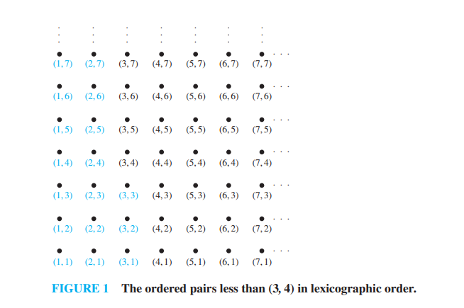
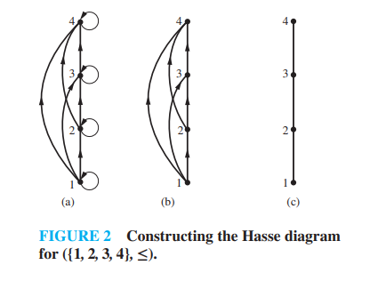
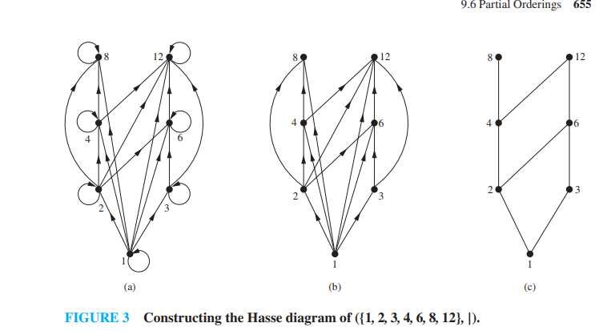

# Partial Orderings (Sections 9.6 - 9.6.3)

---

While equivalence relations are used to group elements that are *"the same,"* **partial orderings** are used to **rank or order elements**, determining which items come "before" or "after" others in a set.

---

### 1. The Core Motivation: Ordering Elements

We use orderings constantly to structure information:
* **Alphabetical Order:** A dictionary orders words alphabetically.
* **Rankings:** A tournament orders players by their scores or rankings.
* **Project Management:** In a PERT chart, tasks are ordered by prerequisites—certain tasks must be finished before others can begin.

With alphabetical order or standard number systems, you can take *any* two items and declare which one comes first. However, with tasks or prerequisites, some elements might be independent:
* *Example (Cooking):* In a recipe, you must crack eggs before cooking them, but it does not matter whether you crack the eggs or pour the milk first—the egg-cracking and milk-pouring are **incomparable**.

Because some items can be ordered but others cannot be compared, we call this a **partial ordering**.

---

### 2. Formal Mathematical Definition

To build an ordering relation, we need a 3-part test similar to the one we used for equivalence relations. However, we swap out the symmetry requirement:

> **Definition 1:** A relation $R$ on a set $S$ is called a **partial ordering** or **partial order** if it is:
> 1. **Reflexive**
> 2. **Antisymmetric**
> 3. **Transitive**
> 
> A set $S$ together with a partial ordering $R$ is called a **partially ordered set**, or simply a **poset**, and is denoted by:
> $$(S, R)$$

#### **Why Antisymmetry Matters Here**
Antisymmetry states that if $(a, b) \in R$ and $(b, a) \in R$, then $a = b$.
* *Intuition:* In terms of ordering, if $a$ comes before or equal to $b$ ($a \preceq b$), and $b$ comes before or equal to $a$ ($b \preceq a$), then $a$ and $b$ must be the exact same element. This property prevents any two distinct elements from pointing back and forth at each other, which keeps a strict directional "flow" to our rankings (preventing loops).

#### **The Notation ($\preceq$)**
Because partial orderings act conceptually like "less than or equal to," mathematicians use the special symbol:
$$\preceq$$
to represent any generic partial ordering relation.
* When we write $a \prec b$, it means $a \preceq b$ but $a \neq b$ (similar to strict "less than", $a < b$).

---

### 3. Textbook Examples

Below are standard textbook cases demonstrating how to test relations systematically to see if they form valid posets.

#### **TEXTBOOK EXAMPLE 1 (Greater Than or Equal To)**
Show that the "greater than or equal to" relation ($\ge$) is a partial ordering on the set of integers $\mathbf{Z}$.

**Solution:**
We systematically check all three properties for the relation $R = \{(a, b) \mid a \ge b\}$ on $\mathbf{Z}$:
1. **Reflexive?** **Yes**, because $a \ge a$ is true for every integer $a$.
2. **Antisymmetric?** **Yes**, because if $a \ge b$ and $b \ge a$, the only possible mathematical reality is that $a = b$.
3. **Transitive?** **Yes**, because if $a \ge b$ and $b \ge c$, then it is guaranteed that $a \ge c$.

Since the relation satisfies all three criteria, $(\mathbf{Z}, \ge)$ is a valid **poset**.

---

#### **TEXTBOOK EXAMPLE 2 (The Divides Poset)**
Show that the "divides" relation ($\mid$) is a partial ordering on the set of positive integers $\mathbf{Z}^+$.

**Solution:**
Let's run our test for $R = \{(a, b) \mid a \text{ divides } b\}$ on $\mathbf{Z}^+$:
1. **Reflexive?** **Yes**, because every positive integer divides itself:
   $$a \mid a \implies (a, a) \in R$$
2. **Antisymmetric?** **Yes**, because if $a$ divides $b$ ($a \mid b$) and $b$ divides $a$ ($b \mid a$), then $a = b$. 
   * *Note:* This is why the example specifies **positive** integers $\mathbf{Z}^+$. If negative integers were allowed, $2 \mid -2$ and $-2 \mid 2$ but $2 \neq -2$, breaking antisymmetry!
3. **Transitive?** **Yes**, because if $a \mid b$ (meaning $b = ak$ for some integer $k$) and $b \mid c$ (meaning $c = bm$ for some integer $m$), then:
   $$c = (ak)m = a(km)$$
   which proves that $a \mid c$ (since $km$ is an integer).

Since it is reflexive, antisymmetric, and transitive, $(\mathbf{Z}^+, \mid)$ is a valid **poset**.

---

### 🧠 Quick Check: Try it Yourself!

Let $S = \{1, 2, 3\}$. Consider the strict "less than" relation:
$$R = \{(a, b) \mid a < b\}$$
which consists of the ordered pairs: $\{(1, 2), (1, 3), (2, 3)\}$.

1. Is this relation **reflexive**? (Is $(1, 1)$ in the set?)
2. Based on your answer, is $(S, <)$ a valid **poset**?

---

### 💡 Solutions & Explanation

> [!NOTE]
> Here are the step-by-step verification answers for the check above:
> 
> * **1. Is it reflexive?** **No**.
>   * *Proof:* A relation is reflexive if $(a, a) \in R$ for every element $a \in S$. For the strict "less than" relation on $S = \{1, 2, 3\}$, the value $1$ is not strictly less than $1$ ($1 < 1$ is false). Therefore, $(1, 1) \notin R$ (and similarly, $(2, 2) \notin R$ and $(3, 3) \notin R$). 
> * **2. Is $(S, <)$ a valid poset?** **No**.
>   * *Proof:* By Definition 1, a partial ordering (poset) must satisfy all three properties: reflexivity, antisymmetry, and transitivity. Since the strict "less than" relation fails reflexivity completely, it is not a valid poset. *(Note: strict orderings are called strict partial orders, which are irreflexive, asymmetric, and transitive).*

---

---

### Section 9.6.2: Lexicographic Order

This section covers how we sort strings, words, and combinations of pairs mathematically. Conceptually, this generalizes standard alphabetical and numerical sequencing.

#### **1. The Core Idea: Dictionary Sorting**
When you look up words in an English dictionary, they are sorted using a simple step-by-step strategy:
* You look at the first letter of both words. If they are different, that decides which word comes first (e.g., *apple* comes before *banana* because $a$ comes before $b$).
* If the first letters are the same, you move to the second letter (e.g., *disaster* comes before *distance* because the fifth letter $e$ comes before $a$).

In discrete mathematics, we generalize this exact strategy to order ordered pairs, tuples, and strings of any length. We call this **lexicographic order** (or simply **dictionary order**).

---

#### **2. Lexicographic Order for Ordered Pairs**

Let $(A, \preceq_1)$ and $(B, \preceq_2)$ be two posets. We can define a partial ordering $\preceq$ on the Cartesian product $A \times B$ as follows:

> **The Pairs Definition:** We say that $(a_1, a_2)$ is strictly less than $(b_1, b_2)$—written as:
> $$(a_1, a_2) \prec (b_1, b_2)$$
> if and only if:
> 1. $a_1 \prec_1 b_1$ (The first element is strictly smaller in poset $A$), **OR**
> 2. $a_1 = b_1$ and $a_2 \prec_2 b_2$ (The first elements are identical, but the second element is strictly smaller in poset $B$).

We include equality by stating $(a_1, a_2) \preceq (b_1, b_2)$ if $(a_1, a_2) \prec (b_1, b_2)$ or if the two pairs are completely identical ($a_1 = b_1$ and $a_2 = b_2$).

#### **TEXTBOOK EXAMPLE 8**
Let $(\mathbf{Z} \times \mathbf{Z}, \preceq)$ be the poset where $\preceq$ is the lexicographic order based on the standard "less than or equal to" relation ($\le$) on integers.
Determine whether these statements are true:
1. $(3, 5) \prec (4, 2)$
2. $(3, 5) \prec (3, 8)$

* **Solution:**
  1. For $(3, 5)$ vs $(4, 2)$: We compare the first coordinates, $3$ and $4$. Since $3 < 4$, the first condition is met immediately. The second coordinate does not matter. **True.**
  2. For $(3, 5)$ vs $(3, 8)$: We compare the first coordinates. They are identical ($3 = 3$). Thus, we compare the second coordinates, $5$ and $8$. Since $5 < 8$, the second condition is met. **True.**

---

#### **3. Lexicographic Order for Strings**

To order strings of characters, the rule works exactly the same way, but it handles strings of different lengths by adding one extra condition: **if one string runs out of characters completely while matching another string, the shorter string comes first.** (e.g., *pan* comes before *panther*).

> **The Strings Definition:** Let $a_1a_2\dots a_m$ and $b_1b_2\dots b_n$ be two strings. The first string is less than the second if:
> * They match up to a certain point, and at the first position $k$ where they differ, $a_k \prec b_k$ in the alphabet's ordering.
> * **OR** if $m < n$ and $a_1 = b_1, a_2 = b_2, \dots, a_m = b_m$ (the first string is a prefix shorthand of the longer string).

#### **TEXTBOOK EXAMPLE 10**
Consider words formed by English letters sorted alphabetically. Why does **`discreet`** come before **`discrete`**?

* **Solution:**
  We compare the letters position-by-position:
  * Positions 1 to 6 (`d-i-s-c-r-e`): All letters match perfectly.
  * Position 7: We compare **`e`** (in `discreet`) vs **`t`** (in `discrete`).
  Since `e` comes before `t` in standard alphabetical order, the word **`discreet`** is strictly smaller than **`discrete`** in lexicographic order.

---

### 🧠 Quick Check: Try it Yourself!

Using standard lexicographic ordering on pairs of integers based on standard $(\mathbf{Z}, \le)$, sort these four ordered pairs from **smallest to largest**:
$$(2, 8), \quad (1, 9), \quad (2, 3), \quad (5, 1)$$

---

### 💡 Solutions & Explanation

> [!NOTE]
> Here is the step-by-step verification answer for the check above:
> 
> * **Sorted Order (Smallest to Largest):**
>   $$\mathbf{(1, 9) \prec (2, 3) \prec (2, 8) \prec (5, 1)}$$
> * **Step-by-Step Proof:**
>   1. **Group by First Coordinate:** We look at the first coordinates: $1$ (for $(1, 9)$), $2$ (for $(2, 8)$ and $(2, 3)$), and $5$ (for $(5, 1)$).
>   2. **Order Groups:** Since $1 < 2 < 5$, the group with first coordinate 1 is the smallest, and the group with first coordinate 5 is the largest.
>      $$(1, 9) \prec \{(2, 8), (2, 3)\} \prec (5, 1)$$
>   3. **Break Tie for First Coordinate 2:** We compare the second coordinates of $(2, 8)$ and $(2, 3)$. Since $3 < 8$, we get:
>      $$(2, 3) \prec (2, 8)$$
>   4. **Combine Results:** Placing the resolved tie back into our ordering yields the final sorted list: $(1, 9) \prec (2, 3) \prec (2, 8) \prec (5, 1)$.

---

### 🌐 Extra Challenge: Lexicographic Grid Visualization

Consider the lattice grid shown below representing all ordered pairs that are strictly less than $(3, 4)$ in lexicographic order based on standard $(\mathbf{Z}^+ , \le)$.

#### **Questions:**
1. Using the Pairs Definition of lexicographic order, explain why the pairs $(1, 7)$, $(2, 5)$, and $(3, 2)$ are all plotted in this diagram.
2. Explain why the pairs $(3, 4)$, $(3, 6)$, and $(4, 1)$ are **not** plotted in this diagram.

---

### 💡 Extra Challenge: Detailed Solution

> [!TIP]
> Try to solve the questions above on your own before expanding the solution details below!
> 
> * **1. Plotted Pairs Analysis (Strictly Less than $(3, 4)$):**
>   * **$(1, 7)$:** We compare first coordinates: $1$ vs $3$. Since $1 < 3$, the first condition of lexicographic order is met immediately ($1 \prec_1 3$). The second coordinate does not matter. Thus, $(1, 7) \prec (3, 4)$ (and all other pairs in Column 1 are strictly less than $(3, 4)$).
>   * **$(2, 5)$:** We compare first coordinates: $2$ vs $3$. Since $2 < 3$, $(2, 5) \prec (3, 4)$ is immediately true. (This applies to all pairs in Column 2).
>   * **$(3, 2)$:** We compare first coordinates. They are identical ($3 = 3$). Thus, we compare the second coordinates: $2$ vs $4$. Since $2 < 4$, the second condition is met, so $(3, 2) \prec (3, 4)$ is true. (This applies to Column 3 below row 4).
> 
> * **2. Excluded Pairs Analysis (Not Strictly Less than $(3, 4)$):**
>   * **$(3, 4)$:** Comparing first coordinates gives a match ($3 = 3$), and comparing second coordinates gives a match ($4 = 4$). The two pairs are identical, so $(3, 4)$ is *not strictly less* than itself.
>   * **$(3, 6)$:** First coordinates match ($3 = 3$), but the second coordinate comparison fails because $6 > 4$. Thus, $(3, 6) \succ (3, 4)$.
>   * **$(4, 1)$:** Comparing first coordinates shows $4 > 3$. Since the first coordinate is larger, the pair is strictly larger, regardless of the second coordinate. Thus, $(4, 1) \succ (3, 4)$.

---

### Section 9.6.3: Hasse Diagrams

We already know that we can represent a relation using a directed graph (digraph). However, because partial orderings (posets) are *always* reflexive and transitive, their standard digraphs are absolutely cluttered with loops at every vertex and shortcut arrows everywhere.

To fix this, a mathematician named Helmut Hasse created a shorthand simplification method called a **Hasse Diagram** that strips away all redundant information.

#### **1. How to Build a Hasse Diagram (The 3-Step Strip Down)**

Let's understand how a standard digraph is transformed into a clean Hasse diagram by removing the redundant information step-by-step:

* **Step 1: Delete all loops**
  Since every poset is reflexive by definition, we *know* that every element relates to itself ($a \preceq a$). We don't need to see them, so we completely remove the circular loop arrows from every vertex.
* **Step 2: Delete all transitive "shortcut" arrows**
  Since every poset is transitive, if we have an arrow $a \rightarrow b$ and $b \rightarrow c$, we *know* the shortcut $a \rightarrow c$ must exist. To clean up the graph, we delete all of these redundant long-distance shortcut arrows. We only keep the immediate "next-step" connections (called *immediate predecessors*).
* **Step 3: Arrange vertically and remove arrowheads**
  We arrange the vertices on the page so that if $a \preceq b$, vertex $b$ is physically placed **higher up** on the page than vertex $a$. Because "up" always represents going to a larger element, we can erase the arrowheads completely and just draw clean, straight line segments.

---

#### **2. Textbook Example: Constructing a Division Hasse Diagram**

Draw the Hasse diagram for the "divides" relation ($\mid$) on the set $A = \{1, 2, 3, 4\}$.

##### **Solution Walkthrough:**
1. **Identify the baseline relations:** 1 divides everything ($1 \mid 2, 1 \mid 3, 1 \mid 4$). 2 divides 4 ($2 \mid 4$).
2. **Arrange Vertically:**
   * $1$ is at the absolute bottom because it divides all other elements.
   * $2$ and $3$ go on a level above $1$.
   * $4$ goes on the highest level above $2$ (since $2 \mid 4$).
3. **Connect the immediate steps:**
   * Draw a line from $1$ up to $2$, and from $1$ up to $3$.
   * Draw a line from $2$ up to $4$.
   * *Do we draw a line from 1 straight to 4?* **No!** That is a transitive shortcut because $1 \mid 2$ and $2 \mid 4$. We leave it out to keep the Hasse diagram clean.
   * *Do we connect 3 to 4?* No, 3 does not divide 4.

Below is the visual step-by-step construction of the Hasse diagram for $(\{1, 2, 3, 4\}, \le)$ (or divides, depending on the poset).

*(Note: Figure 2 above from the textbook shows the three steps of stripping down the digraph for a linearly ordered poset $(\{1, 2, 3, 4\}, \le)$ where every element is comparable. In this case, 1 connects to 2, 2 to 3, and 3 to 4, forming a single straight chain).*

---

#### **3. Extreme Elements: Maximal and Minimal**

Hasse diagrams make it incredibly easy to find special "extreme" values just by looking at the top and bottom of the drawing:

* **Maximal Elements:** Elements that have no lines continuing *above* them. They are the "tops" of their respective branches.
* **Minimal Elements:** Elements that have no lines continuing *below* them. They sit at the absolute bottoms of the branches.

---

### 🧠 Quick Check: Try it Yourself!

Let's test your visual understanding of this diagram format:

**Problem:** Look back at our divides Hasse diagram for the set $\{1, 2, 3, 4\}$ where lines connect $1-2$, $1-3$, and $2-4$.

1. Can you travel from $1$ to $4$ by moving strictly upwards along the drawn lines? Does this mean $1 \preceq 4$ is true?
2. Can you travel from $3$ to $4$ by moving strictly upwards along a drawn line? Does this mean $3 \preceq 4$ is true?

---

### 💡 Solutions & Explanation

> [!NOTE]
> Here are the step-by-step visual trace solutions:
>
> * **1. Can you travel from $1$ to $4$ upwards?** **Yes**.
>   * *Visual Trace:* You can start at $1$, move upwards along the line to $2$, and then move upwards along the line to $4$. Because there is an upward path $1 \rightarrow 2 \rightarrow 4$, we have $1 \preceq 4$ (which is $1 \mid 4$, "1 divides 4", which is mathematically true).
> * **2. Can you travel from $3$ to $4$ upwards?** **No**.
>   * *Visual Trace:* There is no line connecting $3$ to $4$, and no sequence of lines that lets you go from $3$ up to $4$. You would have to go down to $1$ and then up to $2$ and $4$, which is not allowed (you must move strictly upwards). Therefore, $3 \preceq 4$ is **False** (indeed, 3 does not divide 4).

---

### 🌐 Extra Challenge: Analyzing a Complex Hasse Diagram

Let's look at a more complex poset: the divides relation ($\mid$) on the set $\{1, 2, 3, 4, 6, 8, 12\}$.

#### **Questions:**
1. List all the **minimal** elements of this poset.
2. List all the **maximal** elements of this poset.
3. Is $2 \preceq 12$ true in this poset? Verify this using a visual trace on the Hasse diagram.
4. Is $3 \preceq 8$ true in this poset? Verify this using a visual trace.

---

### 💡 Extra Challenge: Detailed Solution

> [!TIP]
> Try to solve the questions above on your own before expanding the solution details below!
>
> * **1. Minimal Elements:** **$\{1\}$**.
>   * *Proof:* Looking at the absolute bottom of the diagram (Figure 3c), $1$ is the only element that has no lines going below it. Therefore, it is the unique minimal element. (It divides all other elements in the set).
> * **2. Maximal Elements:** **$\{8, 12\}$**.
>   * *Proof:* The elements $8$ and $12$ are at the top of their respective branches and have no lines continuing above them in the diagram. (No other numbers in our set are multiples of 8 or 12).
> * **3. Is $2 \dots 12$ true?** **Yes**.
>   * *Visual Trace:* You can trace upward from $2$ to $4$ (since $2 \mid 4$), and then upward from $4$ to $12$ (since $4 \mid 12$). Alternatively, you can trace upward from $2$ to $6$ (since $2 \mid 6$), and then upward from $6$ to $12$ (since $6 \mid 12$). Both paths demonstrate that $2 \preceq 12$ is true.
> * **4. Is $3 \dots 8$ true?** **No**.
>   * *Visual Trace:* Starting at $3$, you can only move upward to $6$ and then to $12$. There is no path going upwards from $3$ to $8$. Therefore, $3 \preceq 8$ is false (3 does not divide 8).

---

## Related Links
- [[28. Equivalence Relations]] - The previous section detailing equivalence relations and 3-part partition tests.
- [[Sets, Relations and Functions Index]] - Main chapter index and syllabus checklist for Sets, Relations, and Functions.
- [[Discrete Mathematics Dashboard]] - Central dashboard for tracking progress across all chapters.
